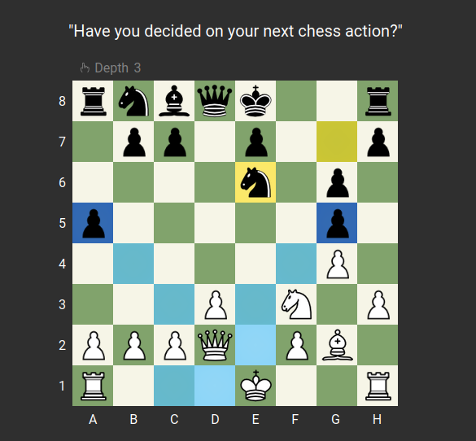

# Chess Engine 🤖

Welcome to Web chess, a chess game powered by HTML, CSS, JavaScript, and jQuery. Challenge your strategic thinking and enjoy an engaging chess experience!

## Features

- **AI Player**: Our chess engine can predict moves for the AI player up to a depth of 4, providing a challenging opponent.
- **Object-Oriented Design**: The game is built using object-oriented programming with JavaScript, promoting clean and maintainable code.
- **Interactive Interface**: Play against the computer or challenge a friend with our intuitive and user-friendly interface.
- **Move History**: Review your game by accessing the move history, perfect for analyzing strategies and learning from your matches.

## Technologies Used
- HTML 
- CSS 
- JavaScript 
- jQuery 

## Screenshots

## License

This project is licensed under the MIT License.

